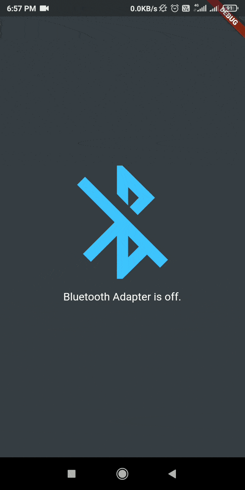

# Bluetooth and Flutter 

- An App on  Flutter for Showing List the available and Active Bluetooth devices and connects with them	

## Features

- Adapter status monitoring,
- Discovering devices (and requesting discoverability),
- Listing bonded devices and pairing new ones,
- Connecting to multiple devices at the same time,
- Sending and receiving data (multiple connections).
- Right now it cannot differentiate between Bluetooth Classic and Bluetooth Low Energy (BLE) 

## Working 

## Getting Started

This project is a starting point for a Flutter application.

A few resources to get you started if this is your first Flutter project:

- [Lab: Write your first Flutter app](https://flutter.dev/docs/get-started/codelab)
- [Cookbook: Useful Flutter samples](https://flutter.dev/docs/cookbook)

For help getting started with Flutter, view our
[online documentation](https://flutter.dev/docs), which offers tutorials,
samples, guidance on mobile development, and a full API reference.
